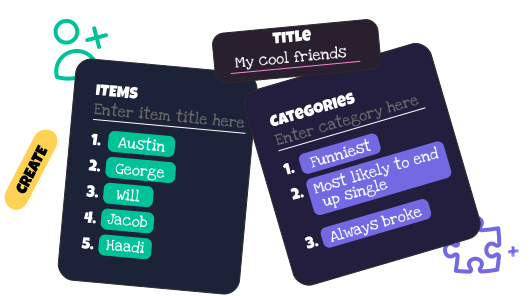
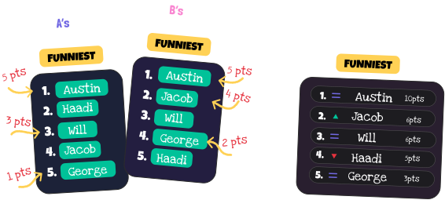

# Rankems 🏆

**Interactive Social Ranking Platform** - Create and participate in fun ranking games! Rank your friends, favorite movies, foods, or anything you can imagine.

[](https://www.rankems.xyz)
[](https://nextjs.org)
[](https://www.typescriptlang.org)
[](https://www.mongodb.com)

---

## 🎯 How It Works

### 1. Create Your Ranking Game
<div align="center">
  
</div>

**Set up your perfect ranking game in seconds!**
- Add items to be ranked (friends, movies, foods, anything!)
- Select categories for more detailed rankings
- Choose your voting mode: **Public** (anyone can vote), **Private** (code required), or **Restrictive** (only specified people can vote)

---

### 2. Interactive Drag & Drop Ranking
<div align="center">
  
</div>

**Intuitive ranking experience with smooth animations**
- Drag and drop items to arrange them in your preferred order
- Navigate through multiple categories seamlessly
- In restrictive mode, users select their identity before ranking
- Real-time visual feedback with Framer Motion animations

---

### 3. Smart Point System & Results
<div align="center">
  
</div>

**Sophisticated scoring algorithm for fair results**
- Points awarded based on ranking position (6 items = 1st place gets 6 points, 2nd gets 5 points, etc.)
- Automatic aggregation across all voters and categories
- Live result updates with increase/decrease indicators
- Beautiful visualization of final rankings

---

### 4. Restrictive Voting Mode
<div align="center">
  
</div>

**Perfect for friend groups and exclusive voting**
- When ranking friends, only those friends can participate
- Users must select their identity from the created items
- Prevents duplicate voting and ensures authentic results
- Ideal for group activities and social gatherings

---

## ✨ Features

- 🎨 **Beautiful UI/UX** - Modern design with smooth animations
- 🔒 **Multiple Voting Modes** - Public, Private, and Restrictive options
- 📱 **Fully Responsive** - Works perfectly on all devices
- 🚀 **Real-time Updates** - See results update live as people vote
- 🎯 **Multi-category Ranking** - Rank items across different categories
- ✏️ **Edit Your Vote** - Change your rankings anytime
- 📊 **Advanced Analytics** - Track engagement and voting patterns
- 🔗 **Easy Sharing** - Share games with simple codes or links
- 💾 **No Signup Required** - Start ranking immediately

---

## 🛠️ Tech Stack

**Frontend:**
- [Next.js 15](https://nextjs.org) - React framework with App Router
- [TypeScript](https://www.typescriptlang.org) - Type-safe development
- [Tailwind CSS](https://tailwindcss.com) - Utility-first styling
- [Framer Motion](https://www.framer.com/motion/) - Smooth animations
- [React Hot Toast](https://react-hot-toast.com) - Beautiful notifications

**Backend:**
- [MongoDB](https://www.mongodb.com) - Document database
- [Mongoose](https://mongoosejs.com) - MongoDB object modeling
- Server Actions - Modern Next.js data fetching

**Deployment & Analytics:**
- [Vercel](https://vercel.com) - Deployment platform
- [Vercel Analytics](https://vercel.com/analytics) - User behavior tracking

---

## 🚀 Getting Started

1. **Clone the repository**
   ```bash
   git clone https://github.com/yourusername/rankems.git
   cd rankems
   ```

2. **Install dependencies**
   ```bash
   npm install
   ```

3. **Set up environment variables**
   ```bash
   cp .env.example .env.local
   # Add your MongoDB connection string
   ```

4. **Run the development server**
   ```bash
   npm run dev
   ```

5. **Open your browser**
   Navigate to [http://localhost:3000](http://localhost:3000)

---

## 📈 Project Stats

- **1,800+** total visitors
- **4,000+** page views
- **60%** user engagement rate
- **Real-time** ranking system
- **3** distinct voting modes

---

## 🤝 Contributing

Contributions are welcome! Please feel free to submit a Pull Request.

---

## 📄 License

This project is open source and available under the [MIT License](LICENSE).

---

<div align="center">
  <p>Made with ❤️ by <a href="https://github.com/yourusername">Abdul Moid Khan</a></p>
  <p>
    <a href="https://www.rankems.xyz">🌐 Live Demo</a> •
    <a href="#-features">✨ Features</a> •
    <a href="#-how-it-works">🎯 How It Works</a>
  </p>
</div>
